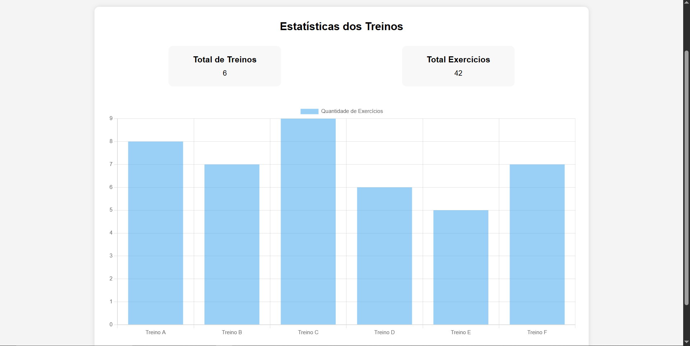
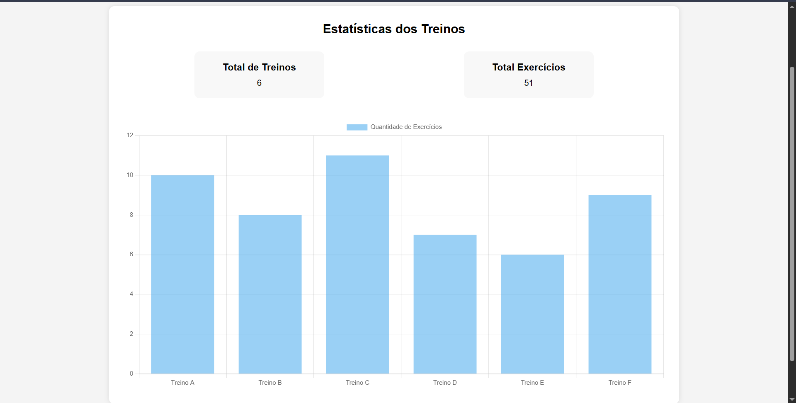

# semana-14-atividade-diw-tiago

Projeto Academia Fitness
Autor

Nome: Tiago Belico de Oliveira e Silva

Matrícula: 910748

Funcionalidade Implementada
Dashboard de Treinos com Chart.js

Foi desenvolvida uma página de dashboard para apresentar visualmente os dados dos treinos da academia.

A funcionalidade utiliza a biblioteca Chart.js para gerar um gráfico de barras que exibe a quantidade de exercícios cadastrados em cada treino (A, B, C, D, E e F).

Biblioteca Utilizada
Chart.js
Fluxo da Aplicação
Os dados dos treinos são armazenados em um arquivo JSON.
O JavaScript realiza a leitura desses dados.
As informações são processadas e organizadas.
O Chart.js gera automaticamente o gráfico de barras.
Sempre que os dados são alterados, o gráfico é atualizado.

